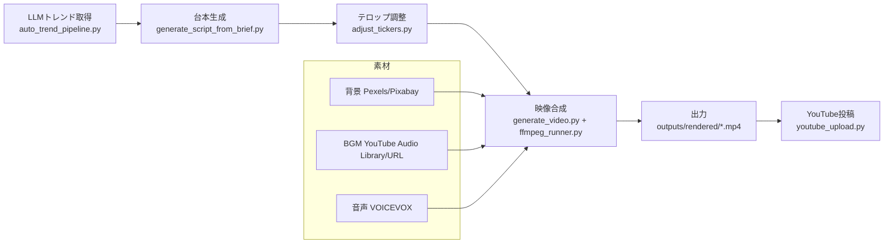

# Auto Video Generator: 機能仕様 (DeepWiki Lv2)

## ✨ TL;DR
- トレンド取得→台本生成→テロップ調整→映像合成→YouTube投稿を一連で実行する機能群。
- CLI/UI双方で操作可能。定期実行では LLM トレンド取得と `--adjust-tickers` を強制し short/通常を自動判定。
- 背景は Pexels/Pixabay、BGMは YouTube Audio Library/指定URL。音声は VOICEVOX。
- テロップは Pillowで事前計測し縮小/改行。short_mode=autoで60秒以下は縦1080x1920。
- リスク: Pixabay 400、テロップ長文ではみ出し、YouTubeトークン期限切れ。フォント実パス解決で文字化けを抑制し、再認証とクエリ短縮が必要。

## 📚 用語・前提
- short_mode: `auto/off/short/inherit`。autoは60秒以下で縦。
- adjust_tickers: テロップ幅調整（Pillow）。自動実行は強制ON。
- bg_keyword: 背景検索キーワード（YAMLから取得）。
- upload_prep: 台本YAMLの title/desc/tags セクション。
- credentials: `~/.config/auto-video-generator/youtube_credentials.pickle` デフォルト。

## 🧭 背景（なぜこの機能が必要か）
- トレンド動画量産で手作業を減らしたいが、台本・音声・映像・投稿で工数が高い。
- ショート需要増で縦動画のレイアウト崩れが顕在化し、事前調整が必須。
- 自動化フロー中で素材取得や認証が頻繁に失敗するため、ロバストな運用手順が必要。

## 🏗️ 機能概要（フロー図）

## 🛠️ 使用方法（CLI/UI）
- CLI: `python scripts/auto_trend_pipeline.py --source llm --adjust-tickers --short-mode auto --youtube-client-secrets <path> --youtube-credentials <path>`  
  - 1トレンド→1台本→1動画→任意でYouTube投稿。
- GUI: メイン画面で「AI台本生成」→「動画生成」→「YouTubeアップロード」。設定画面でAPIキー/クレデンシャル/素材優先度を指定。別ウィンドウのプレビュー（映像+YAML）で事前レイアウト確認が可能。
- 定期実行UI: タスク追加でカテゴリ/ショート指定/追加キーワード/同時実行数を設定。次回実行リストでスケジュール確認。

## 📊 設定とパラメータ
| 項目 | 説明 | デフォルト |
|------|------|-----------|
| short_mode | auto/off/short/inherit | auto |
| adjust_tickers | テロップ幅調整を有効化 | 自動実行は強制ON |
| max_keywords | LLMトレンド候補数 | 10 |
| llm_category | LLMに渡すカテゴリヒント | なし |
| extra_keyword | 追加キーワード（20文字推奨） | なし |
| theme_id | テーマID（configs/themes） | lifehack_surprise |
| sections | 台本セクション数 | 5 |
| brief_template | ブリーフのフォーマット | `{keyword}`入り |
| interval_minutes | ループ間隔（分） | 0 |
| max_runs | ループ回数上限 | 0 |
| youtube_client_secrets | OAuthクライアントJSONパス | なし |
| youtube_credentials | トークンpickle保存先 | `~/.config/.../youtube_credentials.pickle` |
| youtube_privacy | private/unlisted/public | private |
| bg_priority | Pexels/Pixabay優先順位 | 設定画面で指定 |

## 🔧 運用（推奨フロー）
- 定期実行: `auto_trend_pipeline.py --source llm --adjust-tickers --short-mode auto` をスケジューラUIから登録。履歴重複を避けるため window_days=30 を維持。
- 手動生成: GUIでブリーフ入力→生成。ショートの場合は生成後にプレビューウィンドウまたは `render_snapshot.py` で1フレーム確認すると安全。
- YouTube投稿: 認証テスト→失敗時はトークン削除→再認証。upload_prep がある台本を優先。

## ⚠️ 落とし穴と対策
- Pixabay 400: クエリが長い/日本語混在。Pexels優先やクエリ短縮を検討。
- テロップはみ出し/文字化け: `--adjust-tickers` でPillow計測→縮小/簡易改行（1行18–22字目安）。`_resolve_font_path` で fc-match+macOSヒラギノにフォールバック済み。`render_snapshot.py` で事前確認。
- トークン失効: 認証テスト失敗時はトークン削除→再認証。cron運用では期限切れを考慮。
- VOICEVOX未起動: 音声生成失敗をログで確認。先にエンジン起動。
- 多重実行: 同時実行数を抑制し、素材の衝突やアップロード制限を回避。

## 🔗 参考
- 設計書: `docs/設計書.md`
- DeepWiki概要(Lv1): `docs/deepwiki_overview.md`
- テロップ調整: `scripts/adjust_tickers.py`, `src/render/ffmpeg_runner.py`
- 自動生成: `scripts/auto_trend_pipeline.py`, `scripts/generate_video.py`, `scripts/generate_script_from_brief.py`
- 投稿: `scripts/youtube_upload.py`
- プレビュー: `scripts/render_snapshot.py`

## ✅ まとめ
- トレンド→台本→テロップ調整→映像→投稿を一貫自動化。short_modeとadjust_tickersで縦動画品質を確保。
- 背景/BGM/音声を自動取得し、upload_prep でタイトル/説明/タグを制御。
- リスクは素材取得エラー・テロップ長文・認証失効。フォント実パス解決＋事前プレビュー＋再認証手順が鍵。

## 🚀 次のアクション
- Pixabay失敗時の再試行/クエリ短縮を実装。
- テロッププレビューと自動調整をGUIに統合。
- YouTube再認証/トークン削除フローを安定化し、UIから確実に実行できるようにする。

## 🗓️ 追記/更新ログ
- 2025-12-23: Lv2機能仕様として整理（DeepWiki指示書準拠）。
