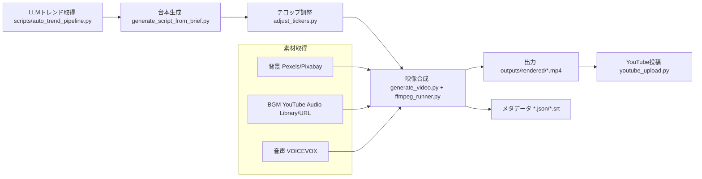

# Auto Video Generator: プロジェクト概要 (DeepWiki Lv1)

## ✨ TL;DR
- AI台本生成→音声合成→映像合成→YouTube投稿までをワンクリック/定期実行で自動化するデスクトップツール。
- トレンド（LLM）からネタを抽出し、short/通常を自動切替。`--adjust-tickers` でテロップ幅を事前調整し縦動画でもはみ出しを抑制。
- 背景は Pexels/Pixabay、BGMは YouTube Audio Library もしくは指定URL、音声は VOICEVOX。出力は `outputs/rendered/*.mp4`。
- YouTubeアップロードは upload_prep を利用し、OAuthトークンで投稿。トークン期限切れ時は再認証が必要。
- 既知課題: Pixabay 400エラー、short時テロップはみ出し残存、YouTubeトークン失効。再認証と素材取得の安定化が優先。

## 📚 用語・前提
- short_mode: `auto/off/short/inherit`。autoは60秒以下で縦1080x1920。
- adjust_tickers: Pillowでテロップ幅を事前計測し縮小/改行（自動実行は強制ON）。
- 背景API: Pexels/Pixabay（lang=ja）。`bg_keyword` をクエリに使用。
- VOICEVOX: `tools/voicevox_engine`。未起動時は音声生成失敗。
- YouTube OAuth: `client_secrets*.json` と `~/.config/auto-video-generator/youtube_credentials.pickle`。

## 🧭 背景（なぜ今）
- トレンド動画を量産したいが、台本・ナレーション・編集の工数が高い。
- ショート需要増加で縦動画対応とテロップ調整が必須。
- 運用では認証切れや素材取得失敗が多く、ログと再試行の仕組みが重要。

## 🏗️ システム概要（Mermaid）

## 🧩 主要機能一覧
- 台本生成（LLM、テーマ切替、short推定）
- テロップ事前調整（幅計測・縮小・簡易改行）
- 背景/BGM自動取得（Pexels/Pixabay/YouTube Audio Library）
- 映像合成（ffmpeg、ショート縦解像度対応、BGMダッキング）
- YouTube投稿（upload_prepからタイトル/説明/タグ抽出、サムネ自動生成）
- 定期実行タスク（トレンド→動画→任意で投稿、次回実行リスト表示）

## ⚙️ 技術スタック
- フロント: Electron (desktop-app/src/renderer, main)
- バックエンド: Python 3.11, pydantic v2, Pillow, requests, yt-dlp, ffmpeg, google-api-python-client
- 音声: VOICEVOXエンジン
- 依存ツール: ffmpeg, Playwright(stepdocs用), pyenv/Homebrew python@3.11 推奨

## 📝 詳細（Lv1要約）
- フロー: トレンド取得（LLM）→ ブリーフ生成 → 台本(YAML) → テロップ調整 → 映像合成 → mp4出力 → 任意でYouTube投稿。
- ショート対応: autoで60秒以下を縦長。テロップ座標/スケール縮小に加え、`--adjust-tickers` で文字幅を制御。
- 素材取得: `bg_keyword` で背景検索。失敗時はローカルデフォルト。BGMはYouTube Audio Library/指定URLを自動DL。
- 認証: YouTube OAuthトークンをpickle保存。失効時は再認証が必要。
- ログ: `logs/scheduler/*.log` に自動実行の詳細、`logs/llm_errors/*` にLLMパース失敗を保存。

## 🔧 実装ポイント（ハイライト）
- テロップ調整: `scripts/adjust_tickers.py`（Pillowで幅計測、フォント未指定時はNoto Sans JP/64pt補完）。`generate_video.py --adjust-tickers` で適用。
- ショート描画: `src/render/ffmpeg_runner.py` 内 `_short_scale` で座標・フォント縮小、縦解像度1080x1920。
- 背景/BGM: Pexels/Pixabayクエリは日本語。BGMは `assets/bgm/youtube/*.mp3` に保存し再利用。
- YouTube投稿: `scripts/youtube_upload.py` が upload_prep を読み、サムネPNGを一時生成。
- 定期実行: `scripts/auto_trend_pipeline.py`（`--adjust-tickers` 強制ON、履歴重複除外、short_mode auto）。

## ⚠️ 運用・落とし穴
- Pixabay 400多発: クエリ短縮 or Pexels優先に設定。失敗時はフォールバックを確認。
- テロップはみ出し: 長文は依然リスク。`render_snapshot.py` で1フレーム確認し、`adjust_tickers` 再実行推奨。
- YouTubeトークン期限切れ: 認証テスト失敗時はトークン削除→再認証。GUIボタンの挙動を確認。
- VOICEVOX未起動: 音声生成失敗がわかりにくい。先にエンジン起動確認。
- 多重実行: 同時並行で素材衝突/アップロード制限の可能性。キュー制御を低めに。

## 🔗 参考
- 設計書（正本）: `docs/設計書.md`
- テロップ調整: `scripts/adjust_tickers.py`, `src/render/ffmpeg_runner.py`
- 自動生成パイプライン: `scripts/auto_trend_pipeline.py`, `scripts/generate_video.py`, `scripts/generate_script_from_brief.py`
- プレビュー: `scripts/render_snapshot.py`
- YouTube投稿: `scripts/youtube_upload.py`
- ログ: `logs/scheduler/*.log`, `outputs/rendered/*.json`
- Qiita DeepWiki元ネタ: https://qiita.com/a32-suzuki/items/c3540da3e009dab1bf97

## ✅ まとめ
- LLMトレンド→台本→テロップ調整→映像合成→YouTube投稿まで自動化し、short/通常を自動判定。
- テロップは `--adjust-tickers` とショート時のスケーリングで縦動画のはみ出しを抑制。
- 背景/BGM/音声を自動取得し、outputs/rendered に集約。upload_prep でタイトル/説明/タグを管理。
- 認証/素材取得/テロップはみ出しが主要リスク。再認証と事前プレビューで回避する。

## 🚀 次のアクション
- Pixabay失敗時の再試行とクエリ短縮を実装。
- テロッププレビュー（render_snapshot）をGUIに統合し、自動調整をワンクリ化。
- YouTube再認証フローとトークン削除ボタンの確実な動作を検証。

## 🗓️ 追記/更新ログ
- 2025-12-23: DeepWiki指示書に従い、プロジェクト概要(Lv1)を再整理。
