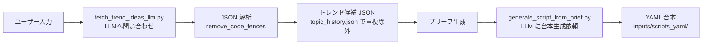

# 🎬 台本生成機能 (Lv2 機能仕様)

## ✨ TL;DR
- LLMトレンド取得 → ブリーフ（要約）生成 → YAML台本生成の3ステップで自動化。
- `fetch_trend_ideas_llm.py` でLLMに問い合わせし、候補JSON取得。`generate_script_from_brief.py` でブリーフからYAML作成。
- 11カテゴリ + 追加キーワードで、LLMにヒントを与え、より適切な台本を生成。
- レスポンスの JSON パースエラーは `remove_code_fences()` で自動修正。タイムアウトは120秒で設定。
- リスク: LLMレスポンスの不正形式、トークン数超過、API Key未設定時の失敗。

## 📚 用語・前提
- **トレンドアイデア**: LLMが提案する動画企画。候補 JSON 形式で複数返却。
- **ブリーフ**: 動画の要約。「◎◎のランキングTOP5」等。LLMに渡す最初のヒント。
- **台本（YAML）**: セクション構造を持つ動画脚本。narration, on_screen_text, hook, evidence, demo, bridge, cta 等を含む。
- **LLM プロバイダ**: Claude, GPT, Codex など。`settings/ai_settings.json` で指定。
- **category**: 生成ヒント用の11カテゴリ（ビジネス、エンタメ、教育等）。
- **extra_keyword**: ユーザー指定の追加キーワード（20文字推奨）。

## 🧭 背景
- 手動で動画企画→台本作成すると工数が高く、量産に向かない。
- 毎日新しいトレンドが出るため、LLM自動抽出で鮮度を確保したい。
- トレンド候補から1件選んでブリーフ化し、さらに台本化という2段階が必要。
- LLM JSON レスポンスはエラーがちなので、パース修正機能が必須。

## 🏗️ 機能概要（フロー図）


### Lv2 含まれる手順
1. **LLMトレンド取得**
   - 11カテゴリからヒント受け取り（デフォルト or ドロップダウン指定）。
   - 追加キーワード埋め込み（例：「ビジネス + 副業」）。
   - 最大件数 `max_ideas` を指定（デフォルト 10件）。
   - LLM から JSON レスポンス受信。

2. **パース修正**
   - レスポンスを `remove_code_fences()` で markdown code fence 除去。
   - JSON 形式でない場合は再度パースを試行（最大3回リトライ）。
   - `topic_history.json` と照合し、重複トピックを除外。

3. **ブリーフ生成**
   - 取得したトレンド候補から1件を選択（UI で確認 or 自動選定）。
   - テンプレート + トレンドテキストから簡潔なブリーフ作成。
   - 例：「最新AI副業Top5」 → ブリーフ：「2025年の最新AI副業テクニックランキング」。

4. **台本生成**
   - ブリーフを `generate_script_from_brief.py` に渡す。
   - LLM が 5-7 セクションの YAML 台本を生成（各セクション 30-50秒想定）。
   - 各セクションに narration, hook, evidence, demo, bridge, cta を埋め込み。

## 🛠️ 使用方法（CLI / UI）
### CLI
```bash
# ステップ1: トレンド取得
python scripts/fetch_trend_ideas_llm.py \
  --max-ideas 6 \
  --category ビジネス \
  --extra-keyword "副業" \
  --output data/trend_ideas.json

# ステップ2: ブリーフ生成（UIか手動）
# UIで候補から1件選択し、ブリーフ入力フィールドに記入。

# ステップ3: 台本生成
python scripts/generate_script_from_brief.py \
  --brief "2025年最新AI副業テクニックTop5" \
  --theme-id lifehack_surprise \
  --sections 5 \
  --output inputs/scripts_yaml/ai_side_gig_01.yaml
```

### GUI
1. **AIトレンド生成**: 
   - 「台本生成」タブ → 「AI台本生成」セクション。
   - カテゴリ（ドロップダウン）と追加キーワード（テキスト入力）を指定。
   - 「AIトレンドから文言生成」ボタンをクリック。
   - ブリーフ欄に「AI候補: ... / 推奨ブリーフ: ...」と表示される。

2. **台本生成**:
   - ブリーフ欄を確認、必要に応じて編集。
   - 「AI台本生成」ボタンをクリック。
   - `inputs/scripts_yaml/` に YAML ファイル自動保存。プレビュー欄で確認。

3. **定期実行設定**:
   - 「スケジューラー」タブ → 「新しいタスク」。
   - インターバル（時間単位）、カテゴリ、追加キーワード、ショート指定を入力。
   - 「保存」で `settings/schedule.json` に記録。次回実行時刻が表示される。

## 📊 設定とパラメータ
| 項目 | 説明 | デフォルト | 必須 |
|------|------|-----------|------|
| category | LLM への世代ヒント（11カテゴリ） | なし | 任意 |
| extra_keyword | 追加キーワード（20字推奨） | なし | 任意 |
| max_ideas | LLM が返す候補数 | 10 | 任意 |
| max_retries | JSON パースリトライ回数 | 3 | 内部 |
| timeout_sec | API 呼び出しタイムアウト（秒） | 120 | 内部 |
| llm_provider | Claude / GPT / Codex | `settings/ai_settings.json` で指定 | 必須 |
| llm_api_key | LLM API Key | 環境変数 or `settings/ai_settings.json` | 必須 |
| theme_id | テーマ名（lifehack_surprise 等） | lifehack_surprise | 任意 |
| sections | セクション数 | 5 | 任意 |
| brief_template | ブリーフテンプレート | "{keyword} の最新情報" | 任意 |

## 🔧 運用（推奨フロー）
### 手動生成フロー
1. UI で「AIトレンド生成」をクリック。
2. ブリーフ内容を確認、編集が必要なら修正。
3. 「AI台本生成」をクリック。
4. プレビュー欄で内容確認。
5. 問題なければ「保存」。

### 定期実行フロー
1. スケジューラー UI でタスク追加。
2. インターバル（例：毎日朝6時）、カテゴリ、ショート指定を入力。
3. 自動実行時に `auto_trend_pipeline.py --source llm` が起動。
4. トレンド取得 → ブリーフ生成 → 台本生成 → 動画生成を一貫実行。
5. 履歴は `work/topic_history.json` に累積（重複は自動除外）。

## ⚠️ 落とし穴と対策
| 問題 | 原因 | 対策 |
|------|------|------|
| JSON パースエラー | LLM が markdown code fence で囲む | `remove_code_fences()` で自動修正（3回リトライ） |
| トークン数超過 | LLM API 月額制限到達 | `settings/ai_settings.json` でプロバイダ切替 or リクエスト削減 |
| API Key 未設定 | 環境変数 or 設定ファイル未入力 | `.env` or `settings/ai_settings.json` に明記 |
| タイムアウト | LLM API が遅延 | `timeout_sec` を増加（デフォルト120秒） or プロバイダ切替 |
| 重複トピック生成 | `topic_history.json` 未初期化 | `work/topic_history.json` を削除し再開始 |

## 🔗 参考
- **スクリプト**:
  - [scripts/fetch_trend_ideas_llm.py](../../../scripts/fetch_trend_ideas_llm.py)
  - [scripts/generate_script_from_brief.py](../../../scripts/generate_script_from_brief.py)
  - [scripts/auto_trend_pipeline.py](../../../scripts/auto_trend_pipeline.py)
- **モジュール**:
  - [src/script_generation/llm.py](../../../src/script_generation/llm.py)
  - [src/script_generation/generator.py](../../../src/script_generation/generator.py)
- **設定**:
  - [settings/ai_settings.json](../../../settings/ai_settings.json)
  - [settings/schedule.json](../../../settings/schedule.json)
- **UI**:
  - [desktop-app/src/renderer/renderer.js](../../../desktop-app/src/renderer/renderer.js)

## ✅ まとめ
- LLM トレンド取得 → ブリーフ生成 → 台本生成で、手動企画を自動化。
- category + extra_keyword で LLM にヒント、より適切な台本を生成。
- JSON パースエラーは `remove_code_fences()` で対応、リトライ機構も備える。
- 定期実行で毎日自動生成、履歴重複を `topic_history.json` で管理。
- API Key 未設定/タイムアウト/トークン超過が主要リスク。

## 🚀 次のアクション
- LLM プロバイダ複数指定時のフェイルオーバー機能実装。
- トレンド候補の UI での複数選択・編集機能追加。
- パース失敗時の自動修正ロジック拡張（YAML 部分修復等）。

## 🗓️ 追記/更新ログ
- 2025-12-23: 初版。Lv2 機能仕様として作成（DeepWiki指示書準拠）。
