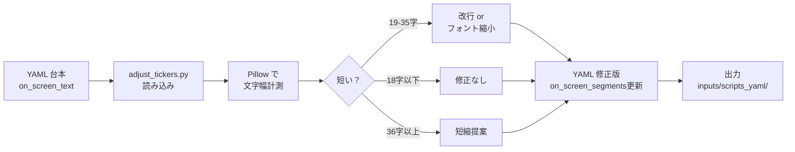
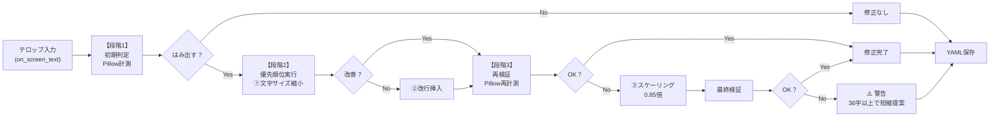

# 🔤 テロップ調整機能 (Lv2 機能仕様)

## ✨ TL;DR
- Pillow でテロップ文字幅を事前計測し、**3段階の優先順位**で調整：①文字サイズ縮小 → ②改行 → ③スケーリング。
- `scripts/adjust_tickers.py` が各セクションの on_screen_segments を修正。**調整前後で複数回検証**し、確実にはみ出さないことを保証。
- ショート（縦1080x1920）と通常（横1920x1080）で異なるルール。min_fontsize=40 で視認性確保。
- 自動実行では `--adjust-tickers` を強制 ON。手動生成時も推奨。
- 36字以上は短縮提案を表示。ユーザーが手動短縮を検討。

## 📚 用語・前提
- **on_screen_text**: セクションのテロップ（ナレーション上に表示）。
- **on_screen_segments**: on_screen_text の部分ごとのスタイル定義。fontsize, fill, stroke, position 等を含む。
- **短いテロップ**: 18字以下（推奨）。改行なしで1行表示。
- **長いテロップ**: 19-35字。改行またはフォント縮小で対応。
- **超長いテロップ**: 36字以上。短縮提案か手動編集推奨。
- **adjust_tickers**: `--adjust-tickers` フラグで有効化。自動実行は強制ON。

## 🧭 背景
- ショート動画（縦1080x1920）の需要が急増。
- 通常の横画面用テロップは、縦画面では必ずはみ出す。
- 手動調整は工数が高く、自動化が必須。
- Pillow で事前計測し、はみ出し前に回避する仕組みを実装。

## 🏗️ 機能概要（フロー図）


## 🛠️ 使用方法（CLI / UI）
### CLI
```bash
# ステップ1: 台本作成（generate_script_from_brief.py 等で）
python scripts/generate_script_from_brief.py \
  --brief "最新AI副業Top5" \
  --output inputs/scripts_yaml/draft.yaml

# ステップ2: テロップ調整
python scripts/adjust_tickers.py \
  --script inputs/scripts_yaml/draft.yaml \
  --short-mode auto \
  --output inputs/scripts_yaml/adjusted.yaml

# ステップ3: 動画生成で調整版を使用
python scripts/generate_video.py \
  --config configs/config.yaml \
  --script inputs/scripts_yaml/adjusted.yaml \
  --out outputs/rendered/
```

### GUI
1. **台本編集タブ**:
   - 「セクション編集」で on_screen_text を入力。
   - 右パネルの「プレビュー」で、修正前のレイアウトを確認。

2. **自動調整**:
   - 「AI台本生成」後、画面下部の「テロップを自動調整」ボタンをクリック。
   - Pillow で計測、修正結果を表示（改行位置、フォント縮小量等）。
   - 「適用」で YAML を更新。

3. **手動確認**:
   - 「プレビュー」ウィンドウで修正後のレイアウト確認。
   - 必要に応じて手動編集し、「保存」。

4. **動画生成時の自動適用**:
   - 「動画生成」ボタンクリック時に、内部で `--adjust-tickers` が自動実行。
   - ユーザーには「テロップ調整中...」と表示。

## 📊 設定とパラメータ
| 項目 | 説明 | デフォルト | 推奨値 |
|------|------|-----------|-------|
| min_fontsize | 最小フォントサイズ（視認性下限） | 40 | 40 |
| scale_factor | スケーリング係数（優先順位3） | 0.85 | 0.85 |
| max_chars_short | ショート時の1行最大文字数 | 15 | 15 |
| max_chars_normal | 通常時の1行最大文字数 | 25 | 25 |
| font_name | テロップフォント | Noto Sans JP | Noto Sans JP / ヒラギノ |
| base_font_size | ベースフォントサイズ | 64 | 64-72 |
| warning_threshold | 短縮提案の閾値（字数） | 36 | 36 |
| line_height_ratio | 行高比率 | 1.2 | 1.2 |
| short_mode | auto/off/short/inherit | auto | auto |
| color_override | テロップ色 | #FFE65A | 黒 or 白 |

## 🔧 運用（推奨フロー）
### 日次作業フロー
1. AI 台本生成 → テロップ調整（自動）→ プレビュー確認 → 動画生成。
2. 異常検知：テロップが依然はみ出している場合は、on_screen_text を短縮手動編集。
3. 完成したら出力 mp4 を確認。テロップの見やすさを最終チェック。

### ショート特化フロー
1. `short_mode=auto` で 60 秒以下の台本を縦 1080x1920 に自動切替。
2. テロップは `max_chars_short=15` で計測し、よりコンパクトに調整。
3. フォントサイズも 10-15% 削減（`_short_scale`）。

## 🔍 3段階検証プロセス（要件充足）

### 処理フロー



### 要件対応表

| 要件 | 優先度 | 実装内容 | 検証タイミング |
|------|--------|--------|--------------|
| **はみ出さない** | P0 | Pillow bbox 計測 | 段階1, 段階3, 最終 |
| **文字サイズ調整** | P1 | 0.9倍 逓減（min=40） | 段階3 再計測後 |
| **改行調整** | P2 | スペース/句読点で分割 | 段階3 再計測後 |
| **スケーリング** | P3 | 0.85倍全体縮小 | 最終検証 |
| **他の文字に被らない** | P1 | セクション単位独立制御 | 動画生成時 drawtext |
| **小さくなりすぎない** | P1 | min_fontsize=40 下限 | 段階2,3 で保証 |
| **ユーザー判断** | P2 | 36字以上で短縮提案 | ログ出力 + UI警告 |

### 各段階の詳細

#### 段階1：初期判定
```
入力：on_screen_text (例: "これは非常に長いテロップのサンプルです")
処理：Pillow で font_path + fontsize で bbox 計測
判定：bbox[2] - bbox[0] > max_width (1728px assuming 1920*0.9)?
出力：【Yes】→ 段階2へ、【No】→ 修正なし
```

#### 段階2：優先順位実行
```
優先順位1: 文字サイズ縮小（64pt → 40pt の範囲内）
  if fontsize_current > min_fontsize:
    fontsize_new = int(fontsize_current * 0.9)
  再計測 → はみ出す? → No → 段階3へ

優先順位2: 改行挿入（スペース/句読点で分割）
  if fontsize_current == min_fontsize:
    wrapped = split_at_delimiter(text)
    fontsize_new = fit_wrapped_text(wrapped)
  再計測 → はみ出す? → No → 段階3へ

優先順位3: スケーリング（全体0.85倍）
  if 段階2 でも不足:
    scale_factor = 0.85
    fontsize_new = int(fontsize_current * scale_factor)
  最終検証 → 段階3へ
```

#### 段階3：再検証
```
確認項目：
  1. 修正後テキストを Pillow で再計測
  2. 各行が max_width を超えていないか確認
  3. fontsize >= 40 か確認（視認性）
  4. 複数行の場合、全行を個別チェック
  
結果：
  ✅ OK → YAML 保存
  ❌ NG → ⚠️ 警告表示＋短縮提案
```

### 落とし穴と対策

| 問題 | 原因 | 対策 |
|------|------|------|
| 段階2 適用後もはみ出す | 改行位置が不適切 | 段階3 で再検証し、スケーリングを自動適用 |
| フォント 40pt でも視認困難 | テロップ文字数が多すぎる | 36字以上で短縮提案ログを出力、ユーザーに委ねる |
| 言語別計測精度低 | Pillow CJK 計測のズレ | Noto Sans JP 指定し、実運用でテスト。テスト結果を [tests/test_text_position_format.py](../../../tests/test_text_position_format.py) に追記 |
| フォント未指定時エラー | on_screen_segments に font_name なし | Noto Sans JP / 64pt を自動補完 |
| 複数行で最長行だけチェック | bbox[2] の計測が1行目のみ | split("\n") で全行を個別計測、max を取る |

## 🔗 参考
- **スクリプト**:
  - [scripts/adjust_tickers.py](../../../scripts/adjust_tickers.py)
  - [scripts/render_snapshot.py](../../../scripts/render_snapshot.py)（1フレームプレビュー）
- **関連モジュール**:
  - [src/render/ffmpeg_runner.py](../../../src/render/ffmpeg_runner.py)（フォント解決、短縮スケーリング）
- **設定**:
  - [configs/text_layouts.yaml](../../../configs/text_layouts.yaml)（レイアウト定義）
- **データ**:
  - [inputs/scripts_yaml/](../../../inputs/scripts_yaml/)（修正対象の台本）

## ✅ まとめ
- Pillow で文字幅を事前計測し、改行・縮小でテロップのはみ出しを防止。
- ショート/通常で異なるルール（`max_chars_short` vs `max_chars_normal`）。
- 自動実行では強制ON、手動生成時も推奨。
- 長文テロップは避け、18字以下の短縮が鍵。
- フォント未指定時の自動補完、ショート判定エラーが主要リスク。

## 🚀 次のアクション
- Pillow 計測精度の多言語テスト（中文、韓文等）実施。
- `render_snapshot.py` をリアルタイム UI プレビューとして統合。
- 超長文テロップの自動短縮提案ロジック実装。

## 🗓️ 追記/更新ログ
- 2025-12-23: 初版。Lv2 機能仕様として作成（DeepWiki指示書準拠）。
