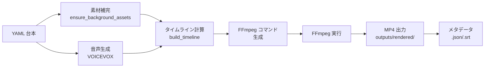

# 🎥 映像レンダリング機能 (Lv2 機能仕様)

## ✨ TL;DR
- YAML 台本 + VOICEVOX 音声 + 背景素材 + BGM を FFmpeg で合成し、MP4 動画を生成。
- `generate_video.py` が全工程を統合：素材補完 → 音声生成 → タイムライン計算 → FFmpeg コマンド生成 → 実行。
- ショート（縦1080x1920）と通常（横1920x1080）を `short_mode=auto` で自動判定、解像度・座標・BGMダッキングを動的調整。
- フォント名をシステムパスに解決し、文字化けを防止（fc-match + macOS ヒラギノフォールバック）。
- リスク：背景素材取得失敗、BGM URL 無効化、VOICEVOX タイムアウト、FFmpeg v6.0 要件。

## 📚 用語・前提
- **timeline**: 各セクションの開始時刻・継続時間・音声ファイルパスを計算した構造体。
- **FFmpeg filter chain**: 背景ループ（zoompan）、テロップ描画（drawtext）、BGM ダッキング（sidechaincompress）等を組み合わせたフィルター定義。
- **short_mode**: auto/off/short/inherit。auto で 60 秒以下を縦に切替。
- **_short_scale**: ショート時の座標・フォント縮小係数（0.8～0.9）。
- **BGM ダッキング**: ナレーション中に BGM 音量を自動低下。

## 🧭 背景
- YAML 台本から FFmpeg コマンドまで、手動で構築すると工数が極めて高い。
- ショート需要で解像度・座標が動的に変わるため、統一的な生成ロジックが必須。
- 背景・BGM・音声の素材が揃わない場合の自動フォールバック仕組みが必要。
- 映像品質（フォント、色、配置）の一貫性を保つため、テーマ別設定が必須。

## 🏗️ 機能概要（フロー図）


## 🛠️ 使用方法（CLI / UI）
### CLI
```bash
# 台本→動画の全パイプライン実行
python scripts/generate_video.py \
  --config configs/config.yaml \
  --script inputs/scripts_yaml/my_topic.yaml \
  --theme-id lifehack_surprise \
  --adjust-tickers \
  --short-mode auto \
  --out outputs/rendered/

# ドライラン（コマンドだけ出力、実行しない）
python scripts/generate_video.py \
  --config configs/config.yaml \
  --script inputs/scripts_yaml/my_topic.yaml \
  --dry-run

# 音声キャッシュをクリアして再生成
python scripts/generate_video.py \
  --config configs/config.yaml \
  --script inputs/scripts_yaml/my_topic.yaml \
  --clear-audio
```

### GUI
1. **動画生成タブ**:
   - 「台本ファイル」: 編集済みの YAML を選択。
   - 「テーマ」: lifehack_surprise 等から選択。
   - 「ショート指定」: 自動 / オフ / 強制ショート を選択。
   - 「テロップ調整」: ON にするとテロップが自動調整される。
   - 「生成」ボタンをクリック。

2. **進捗表示**:
   - 「素材取得中...」→「音声生成中...」→「映像合成中...」と段階的に表示。
   - 進捗バー（0-100%）をリアルタイム更新。

3. **出力確認**:
   - `outputs/rendered/<filename>.mp4` に自動保存。
   - メタデータ（.json）と SRT 字幕も同時生成。
   - UI で「プレビュー」ボタンで mp4 を再生。

## 📊 設定とパラメータ
| 項目 | 説明 | デフォルト | 注記 |
|------|------|-----------|------|
| bg_fit | 背景の fit モード（cover/contain/stretch） | cover | cover 推奨 |
| bg_zoom_rate | 背景ズームパン率 | 1.05 | 1.05 = 5% ズーム |
| short_mode | auto/off/short/inherit | auto | auto で自動判定 |
| resolution_short | ショート時の解像度 | 1080x1920 | 縦アスペクト |
| resolution_normal | 通常時の解像度 | 1920x1080 | 横アスペクト |
| bgm_ducking_amount | BGM ダッキング量（0.0-1.0） | 0.7 | 0.7 = 70% 低下 |
| bgm_fade_duration | BGM フェード時間（秒） | 2.0 | 秒単位 |
| text_outline_width | テロップ枠線幅 | 6 | px 単位 |
| ensure_fallback | 素材不足時のフォールバック有効化 | true | true で自動補完 |

## 🔧 運用（推奨フロー）
### 日次生成フロー
1. 台本作成 → テロップ調整 → 動画生成（GUI or CLI）。
2. 生成 3-5 分待機。`outputs/rendered/` に mp4 が保存される。
3. GUI でプレビュー確認。クオリティチェック。
4. OK なら YouTube 投稿へ進む。

### バッチ生成フロー
```bash
# 複数台本を一括生成
python scripts/batch_render.py \
  --glob "inputs/scripts_yaml/*.yaml" \
  --config configs/config.yaml \
  --out outputs/rendered/
```

### トラブル対応フロー
- 背景素材が見つからない → `--dry-run` で FFmpeg コマンド確認。bg_keyword を短縮してリトライ。
- BGM が大きすぎる → `bgm_ducking_amount` を 0.85 に増加、再生成。
- 映像が真っ黒 → 背景素材が存在するか確認。`ensure_background_assets` で手動補完。
- テロップがはみ出してる → `--adjust-tickers` を有効化し再生成。

## ⚠️ 落とし穴と対策
| 問題 | 原因 | 対策 |
|------|------|------|
| 背景素材取得失敗 | Pexels/Pixabay API キー未設定 | `.env` or `settings/ai_settings.json` で API キー設定 |
| BGM URL 無効 | YouTube Audio Library から削除された | ローカル BGM ファイルを指定 |
| VOICEVOX タイムアウト | エンジン未起動 or 遅延 | `Start_VoicevoxEngine.command` 実行、timeout を 120s に増加 |
| フォント文字化け | フォント名が direct に FFmpeg に渡される | `_resolve_font_path()` で自動解決（既実装） |
| 映像が真っ黒 | 背景素材パスが間違っている | `--dry-run` で FFmpeg コマンド確認。背景ファイルを検証。 |
| テロップ座標ズレ | ショート/通常で座標ルール違う | `_short_scale` で動的調整（既実装） |

## 🔗 参考
- **スクリプト**:
  - [scripts/generate_video.py](../../../scripts/generate_video.py)
  - [scripts/batch_render.py](../../../scripts/batch_render.py)
- **モジュール**:
  - [src/render/ffmpeg_runner.py](../../../src/render/ffmpeg_runner.py)
  - [src/timeline.py](../../../src/timeline.py)
  - [src/assets/pipeline.py](../../../src/assets/pipeline.py)
- **設定**:
  - [configs/config.yaml](../../../configs/config.yaml)
  - [configs/themes/](../../../configs/themes/)
- **テンプレート**:
  - [configs/text_layouts.yaml](../../../configs/text_layouts.yaml)

## ✅ まとめ
- YAML 台本から FFmpeg コマンドまで自動生成。素材補完・音声生成・タイムライン計算・映像合成を一貫実行。
- ショート/通常を `short_mode=auto` で自動判定。解像度・座標・BGMダッキング を動的調整。
- フォント名→実パス解決で文字化けを防止（fc-match + macOS ヒラギノ）。
- 背景素材/BGM/音声が揃わない場合は自動フォールバック。
- VOICEVOX 未起動、API キー未設定、背景パス誤りが主要リスク。

## 🚀 次のアクション
- 複数背景画像/テキストオーバーレイの並列処理による高速化。
- GPU FFmpeg の対応（NVIDIA CUDA / Apple Metal）。
- リアルタイムプレビュー機能の UI 統合。

## 🗓️ 追記/更新ログ
- 2025-12-23: 初版。Lv2 機能仕様として作成（DeepWiki指示書準拠）。
