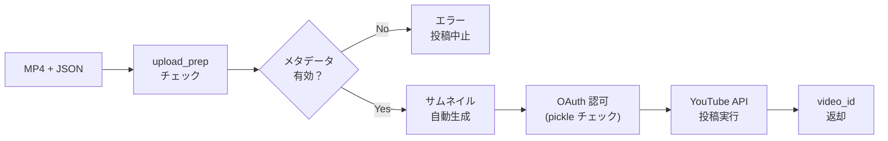

# 📺 YouTube投稿機能 (Lv2 機能仕様)

## ✨ TL;DR
- OAuth 2.0 認証で YouTube API と連携。`upload_prep` セクションから title/description/tags を抽出し、動画投稿。
- `scripts/youtube_upload.py` が MP4 + メタデータ JSON を読み込み、サムネイル（タイトル入り PNG）を自動生成して投稿。
- トークン管理は pickle ファイル（`~/.config/auto-video-generator/youtube_credentials.pickle`）で自動保存。
- 認証テスト機能で OAuth フロー確認。トークン削除ボタンで再認証を強制可能。
- リスク：トークン期限切れ、API quota 制限、upload_prep データ不完全、メタデータ検証エラー。

## 📚 用語・前提
- **OAuth 2.0**: Google の認可フロー。ブラウザで認可 → トークン取得 → pickle 保存。
- **client_secrets.json**: Google Cloud Console から取得したクライアント設定。秘密キーが含まれるため環境変数で管理。
- **youtube_credentials.pickle**: 取得したアクセストークン/リフレッシュトークンを pickle 形式で保存。有効期限 60 日。
- **upload_prep**: YAML 台本の upload_prep セクション。title/description/tags/privacy_status を定義。
- **privacy_status**: private/unlisted/public。デフォルト private（限定公開）。
- **video_category_id**: YouTube の動画カテゴリ ID。29 = 教育、24 = エンタメ等。

## 🧭 背景
- 手動で YouTube 投稿すると毎回ブラウザ操作が必要。自動化で運用工数削減。
- OAuth トークン管理を複雑にしたくないため、pickle 形式で簡潔に保管。
- トレンド動画は毎日量産されるため、定期投稿の自動化が必須。
- メタデータ不完全な場合は投稿を止め、エラーで通知する安全設計。

## 🏗️ 機能概要（フロー図）


## 🛠️ 使用方法（CLI / UI）
### CLI
```bash
# ステップ1: 初回認証（ブラウザで Google アカウント認可）
python scripts/youtube_upload.py \
  --client-secrets client_secrets.json \
  --test-auth

# ステップ2: 動画投稿
python scripts/youtube_upload.py \
  --client-secrets client_secrets.json \
  --credentials-pickle ~/.config/auto-video-generator/youtube_credentials.pickle \
  --video-file outputs/rendered/my_topic.mp4 \
  --metadata outputs/rendered/my_topic.json

# ステップ3: トークン削除（再認証前に）
python scripts/youtube_upload.py \
  --delete-credentials \
  --credentials-pickle ~/.config/auto-video-generator/youtube_credentials.pickle
```

### GUI
1. **認証タブ**:
   - 「YouTube 認証テスト」ボタンをクリック。
   - ブラウザで Google アカウント認可画面が開く。
   - 「許可」をクリック → UI に「認証完了」と表示。
   - トークンは自動保存される（エラー時は「トークンを削除してから再試行」と案内）。

2. **投稿設定**:
   - 「投稿設定」タブで privacy_status を選択（private/unlisted/public）。
   - 「自動投稿を有効化」チェックボックスで、生成後に自動投稿するか選択。

3. **動画投稿**:
   - 「動画生成」完了後、UI に「YouTube に投稿」ボタンが表示。
   - クリック → 進捗表示（「投稿中...」→「成功: video_id=xxx」）。
   - 投稿完了で YouTube リンク表示。

4. **トークン管理**:
   - 「設定」タブ → 「YouTube トークン削除」ボタン。
   - クリック → トークン削除 → 次回投稿時に再認証要求。

## 📊 設定とパラメータ
| 項目 | 説明 | デフォルト | 注記 |
|------|------|-----------|------|
| client_secrets | Google Cloud の JSON ファイルパス | 環境変数 or CLI arg | 秘密キー含む |
| credentials_pickle | トークン保存先 | `~/.config/auto-video-generator/youtube_credentials.pickle` | ユーザー指定可 |
| privacy_status | 公開設定 | private | private/unlisted/public |
| video_category_id | カテゴリ ID | 24 (エンタメ) | 29=教育, 24=エンタメ等 |
| thumbnail_file | サムネイル PNG パス | auto（タイトル入り PNG 生成） | 自動生成 or カスタム |
| enable_auto_upload | 生成後に自動投稿 | false | true でワンクリック |
| upload_timeout_sec | API タイムアウト | 300 | 5 分 |

## 🔧 運用（推奨フロー）
### 手動投稿フロー
1. 動画生成 →「YouTube に投稿」ボタンクリック。
2. 投稿設定を確認（privacy_status, category_id）。
3. 「投稿」ボタンをクリック。
4. 完了後 YouTube リンク表示。

### 自動投稿フロー（定期実行）
1. スケジューラー UI で「YouTube 自動投稿」を有効化。
2. 定期実行タスク実行時に、生成→投稿が一貫実行。
3. 投稿ログは `logs/scheduler/*.log` に記録。

### トークン期限切れ対応
1. 投稿時に「認証失敗」エラー表示。
2. UI の「YouTube トークン削除」で削除。
3. 「認証テスト」で再認証（ブラウザが開く）。
4. 再度投稿試行。

## ⚠️ 落とし穴と対策
| 問題 | 原因 | 対策 |
|------|------|------|
| 認証エラー（401） | トークン期限切れ | トークン削除 → 再認証 |
| quota 超過 | 月間アップロード数上限 | YouTube API 月額プラン確認、容量節約 |
| upload_prep 不完全 | title/description/tags 未指定 | YAML で upload_prep セクション明記 |
| サムネイル生成失敗 | Pillow/ImageMagick なし | デフォルト PNG で代用 or 外部サムネ指定 |
| API Key 無効 | client_secrets.json が古い | Google Cloud Console で再取得 |

## 🔗 参考
- **スクリプト**:
  - [scripts/youtube_upload.py](../../../scripts/youtube_upload.py)
- **モジュール**:
  - [src/outputs.py](../../../src/outputs.py)（メタデータ生成）
- **設定**:
  - [.env.example](.env.example)（環境変数テンプレート）
- **台本フォーマット**:
  - [docs/script_template_spec.md](../../../docs/script_template_spec.md)（upload_prep セクション定義）

## ✅ まとめ
- OAuth 2.0 で YouTube API と連携。トークンは pickle で自動保管・再利用。
- upload_prep から title/description/tags を抽出。サムネイルは自動生成。
- privacy_status で公開設定を制御。private（限定公開）がデフォルト。
- トークン期限切れは「トークン削除→再認証」フロー で対応。
- metadata 検証エラー、quota 制限、API Key 無効が主要リスク。

## 🚀 次のアクション
- 複数チャンネル投稿対応。
- 投稿後の YouTube Analytics 自動連携。
- トークン有効期限の事前通知機能。

## 🗓️ 追記/更新ログ
- 2025-12-23: 初版。Lv2 機能仕様として作成（DeepWiki指示書準拠）。
